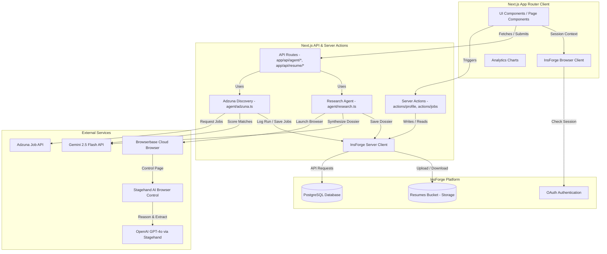

# JobPilot

JobPilot is a full-stack, AI-powered job search, tracking, and matching platform. Users build their profile once, upload their resumes, and let the background agent automatically discover matching tech roles from the Adzuna API. High-scoring jobs are scored and filtered by Gemini 2.5 Flash, and the agent uses a cloud-based browser (Browserbase + Stagehand) to research target companies, constructing structured dossiers to prepare the candidate for their application and interview.

All activity, analytics, and matched metrics are displayed on a real-time, database-backed dashboard built with Next.js 16, Recharts, and Tailwind CSS.

---

## Table of Contents
1. [Tech Stack](#tech-stack)
2. [Project Architecture](#project-architecture)
3. [Folder Structure](#folder-structure)
4. [System Boundaries & Data Flows](#system-boundaries--data-flows)
5. [Database Schema & Storage](#database-schema--storage)
6. [Core Features Deep Dive](#core-features-deep-dive)
    - [Authentication & Route Protection](#1-authentication--route-protection)
    - [Profile & Resume AI Management](#2-profile--resume-ai-management)
    - [Adzuna Job Discovery & AI Matching](#3-adzuna-job-discovery--ai-matching)
    - [Company Research Agent](#4-company-research-agent)
    - [Dashboard Analytics & Activity Feed](#5-dashboard-analytics--activity-feed)
7. [Developer Guardrails & Code Invariants](#developer-guardrails--code-invariants)
8. [Getting Started & Local Setup](#getting-started--local-setup)

---

## Tech Stack

| Layer | Technology | Purpose |
| :--- | :--- | :--- |
| **Framework** | Next.js 16 (App Router) | Full-stack React framework with SSR and API Route handlers |
| **Backend / BaaS** | InsForge | PostgreSQL Database, Authentication, and File Storage |
| **Cloud Browser** | Browserbase | Headless browser execution environment for target company research |
| **Browser Control** | Stagehand v3 | AI-driven browser navigation and page element interaction |
| **AI LLM Engine** | Gemini 2.5 Flash & GPT-4o | Matching, synthesis, and page navigation analysis |
| **PDF Processing** | `pdf-parse` & `@react-pdf/renderer` | Reading uploaded resumes and generating styled PDF profiles |
| **Styling** | Tailwind CSS v4 | CSS utility frameworks and modern responsive layouts |
| **Charts** | Recharts | Interactive SVG analytics charts on the user dashboard |
| **Language** | TypeScript | Type safety across server actions, API routes, and components |

---

## Project Architecture

The architecture separates UI display, business logic / mutations, background agent automation, and the database/BaaS backend layers:



---

## Folder Structure

```
/
├── app/
│   ├── layout.tsx                  # Root layout with Inter font setting
│   ├── page.tsx                    # Homepage Hero & CTA
│   ├── (auth)/
│   │   └── login/                  # OAuth trigger UI page
│   ├── auth/
│   │   └── callback/               # exchanges insforge_code, sets session cookies
│   ├── dashboard/                  # Main analytics & stats dashboard
│   ├── profile/                    # User profile editing and resume upload/download
│   ├── find-jobs/                  # Job listings search, filtering, and sort table
│   │   └── [id]/                   # Individual job details page + research panel
│   └── api/
│       ├── auth/refresh/           # Session cookie refresh token rotation endpoint
│       ├── agent/
│       │   ├── find/               # Adzuna job search API handler
│       │   └── research/           # Company Browserbase research trigger
│       └── resume/
│           ├── generate/           # Profile compilation into PDF stream
│           └── extract/            # PDF text parsing & Gemini extraction
├── agent/
│   ├── adzuna.ts                   # Search agent, concurrency orchestration, and match-scoring
│   └── research.ts                 # Company research agent, Stagehand steps, and dossier synthesis
├── actions/
│   ├── auth.ts                     # Auth Server Actions (signInWithProvider, signOut)
│   ├── profile.ts                  # Server mutations saving profile & storing resumes
│   └── jobs.ts                     # Server actions updating tracked job statuses
├── components/
│   ├── ui/                         # Base design components (buttons, dropdowns, inputs)
│   ├── auth/                       # Google and GitHub provider buttons
│   ├── layout/                     # App shell Navbar and Footer
│   ├── homepage/                   # Landing page panels
│   ├── dashboard/                  # Stats cards, activity lists, and Recharts wrappers
│   ├── profile/                    # Profile Form, Resume Upload & Preview components
│   ├── find-jobs/                  # Jobs table, pagination controls, search inputs
│   └── job-details/                # Match score headers, dossier sections, application buttons
├── lib/
│   ├── insforge-client.ts          # Client-side (browser) InsForge SDK instance
│   ├── insforge-server.ts          # Server-side (SSR) InsForge SDK cookie instance creator
│   ├── browserbase.ts              # Session launcher helper for Browserbase
│   ├── stagehand.ts                # Stagehand initialiser specifying OpenAI/gpt-4o model settings
│   ├── adzuna.ts                   # Adzuna API endpoints wrapper and country helper
│   └── utils.ts                    # Classname mixers and formatting utilities
├── context/                        # Technical context, styling rules, tokens, and progress docs
├── proxy.ts                        # Next.js 16 Proxy - refreshes sessions, protects path routing
├── next.config.ts                  # Next.js configuration declaring serverExternalPackages
└── tsconfig.json                   # TS compiler settings
```

---

## System Boundaries & Data Flows

### 1. UI Mutation Data Flow (Server Actions)
UI-triggered mutations (e.g. saving profile changes or updating application status) bypass Next.js API endpoints and run directly in Server Actions to write to the database:
```
User Form Interaction ➔ Server Action (actions/*) ➔ Server-Side InsForge Client ➔ DB Write ➔ RevalidatePath
```

### 2. Async Agent Operations Flow (API Routes)
Background automation runtimes (such as job discovery or web browsing) execute in Next.js API Routes to prevent blocking user UI rendering:
```
User clicks Find Jobs ➔ API Route (/api/agent/find) ➔ agent/adzuna.ts ➔ Adzuna API ➔ Gemini Scoring ➔ Save to DB ➔ UI Refresh
```

### 3. Company Research Flow
Browsing company public websites operates inside a headless cloud environment via API triggers:
```
Job Details ➔ API Route (/api/agent/research) ➔ agent/research.ts ➔ Browserbase Session ➔ Stagehand Navigation ➔ Gemini Synthesis ➔ Save to Job Record
```

---

## Database Schema & Storage

The InsForge PostgreSQL database comprises the following tables:

### `profiles`
Tracks user details, skills, preferences, and the location of their uploaded resume.
* Primary Key: `id` (references InsForge Auth `auth.users.id`).

| Column | Type | Description |
| :--- | :--- | :--- |
| **id** | `uuid` | Primary Key, maps to authentication account |
| **full_name** | `text` | Full name |
| **email** | `text` | User's email address |
| **phone** | `text` | Contact phone number |
| **location** | `text` | Current city, country |
| **current_title** | `text` | Current professional designation |
| **experience_level**| `text` | junior / mid / senior / lead |
| **years_experience**| `integer` | Count of years in tech |
| **skills** | `text[]` | Array of skill tags for matching |
| **industries** | `text[]` | Target industries |
| **work_experience** | `jsonb` | Array of up to 3 past job structures |
| **education** | `jsonb` | Array of degrees, fields, institutions, graduation years |
| **job_titles_seeking**| `text[]` | Array of job titles sought |
| **remote_preference**| `text` | remote / onsite / hybrid / any |
| **preferred_locations**| `text[]`| Preferred geographical locations |
| **salary_expectation**| `text` | Targeted salary range |
| **cover_letter_tone**| `text` | formal / casual / enthusiastic |
| **linkedin_url** | `text` | LinkedIn URL |
| **portfolio_url** | `text` | Portfolio website URL |
| **work_authorization**| `text` | citizen / permanent_resident / visa_required |
| **resume_pdf_url** | `text` | InsForge Storage URL for resume |
| **is_complete** | `boolean` | True if all required fields are filled |
| **created_at** | `timestamptz`| Row creation timestamp |
| **updated_at** | `timestamptz`| Last update timestamp |

### `agent_runs`
Tracks the history and status of search runs executed by the user.
* Primary Key: `id` (auto-generated uuid).

| Column | Type | Description |
| :--- | :--- | :--- |
| **id** | `uuid` | Primary Key |
| **user_id** | `uuid` | References `profiles.id` |
| **status** | `text` | running / completed / failed |
| **job_title_searched**| `text` | Job title searched |
| **location_searched** | `text` | Location queried |
| **jobs_found** | `integer` | Total jobs returned from Adzuna |
| **started_at** | `timestamptz`| Timestamp of run trigger |
| **completed_at** | `timestamptz`| Timestamp of run completion |

### `jobs`
Main records containing search results, matching scores, and company research dossiers.
* Primary Key: `id` (auto-generated uuid).

| Column | Type | Description |
| :--- | :--- | :--- |
| **id** | `uuid` | Primary Key |
| **run_id** | `uuid` | References `agent_runs.id` (null if manual entry) |
| **user_id** | `uuid` | References `profiles.id` |
| **source** | `text` | search / url |
| **source_url** | `text` | Link to the original listing source page |
| **external_apply_url**| `text` | Direct URL to apply to the employer |
| **title** | `text` | Job title |
| **company** | `text` | Employing company name |
| **location** | `text` | Role location |
| **salary** | `text` | Salary details |
| **job_type** | `text` | fulltime / parttime / contract |
| **about_role** | `text` | 2-3 sentence overview of the role |
| **responsibilities** | `text[]` | Array of responsibilities (bullet points) |
| **requirements** | `text[]` | Array of requirements (bullet points) |
| **nice_to_have** | `text[]` | Array of nice-to-have qualifications |
| **benefits** | `text[]` | Array of job benefits |
| **about_company** | `text` | High-level summary of the company |
| **match_score** | `integer` | AI calculation between 0 and 100 |
| **match_reason** | `text` | Paragraph summarizing the match fit |
| **matched_skills** | `text[]` | Profile skills matching job requirements |
| **missing_skills** | `text[]` | Required job skills missing from profile |
| **company_research** | `jsonb` | The structured dossier generated by the browsing agent |
| **found_at** | `timestamptz`| Date role was discovered |

### `agent_logs`
Holds audit messages logging the step-by-step progress and warnings of active background runs.
* Primary Key: `id` (auto-generated uuid).

| Column | Type | Description |
| :--- | :--- | :--- |
| **id** | `uuid` | Primary Key |
| **run_id** | `uuid` | References `agent_runs.id` |
| **user_id** | `uuid` | References `profiles.id` |
| **message** | `text` | Text describing the step completed or error hit |
| **level** | `text` | info / success / warning / error |
| **job_id** | `uuid` | Optional, links to related record in `jobs.id` |
| **created_at** | `timestamptz`| Timestamp of the log entry |

### Storage Buckets
* **`resumes` Bucket**:
  * Location structure: `resumes/{user_id}/resume.pdf`
  * Restrictions: Authenticated users only. Security policies allow users to read/write only their own directories.

---

## Core Features Deep Dive

### 1. Authentication & Route Protection
* **Protocol**: OAuth 2.0 (Google & GitHub) backed by InsForge Auth. Password authentication is disabled.
* **Server-Driven Handshake**:
  1. The login component initiates authentication by invoking `signInWithProvider(provider)` in `actions/auth.ts`.
  2. The action stashes a `codeVerifier` in a secure, HTTP-only cookie, and returns the authorization URL.
  3. The user is redirected to the provider and returned to `/auth/callback` with an auth code.
  4. The Callback Route Handler exchanges this code via `exchangeOAuthCode()` to set cookie variables `insforge_access_token` and `insforge_refresh_token`.
* **Guard Architecture**:
  * The Next.js 16 proxy (`proxy.ts`) intercepts requests on `/dashboard`, `/profile`, and `/find-jobs`. It uses `updateSession()` from `@insforge/sdk/ssr/middleware` to keep sessions refreshed. If no access token is found in the cookies, it redirects to `/login`.
  * Layout files (like `/app/dashboard/layout.tsx`) perform a server-side guard calling `getCurrentUser()` to catch expired sessions.

### 2. Profile & Resume AI Management
* **Extraction Flow**:
  1. Users upload a PDF (max 5MB) on the profile page.
  2. The PDF is stored in the `resumes` bucket, and a `POST` request goes to `/api/resume/extract`.
  3. The route handler retrieves the document, parses it into plain text with `pdf-parse`, and runs it through Gemini 2.5 Flash.
  4. The model returns structured profile details mapping directly to fields in `profiles` (full name, current title, experience level, years, skills, locations, education, work experience roles).
* **Generation Flow**:
  1. Users click "Generate PDF Resume" on their profile.
  2. A request is sent to `/api/resume/generate`, which runs Gemini 2.5 Flash to polish the candidate's summaries and experience bullet points.
  3. The handler uses `@react-pdf/renderer` inside a `.tsx` route handler to render a single-page PDF document.
  4. The stream is read into buffer chunks, converted to a `Uint8Array`, and uploaded directly to the InsForge Storage bucket.

### 3. Adzuna Job Discovery & AI Matching
* **Job Fetching**:
  * Discoveries are triggered via `/api/agent/find`. The agent calls the Adzuna API matching the title, location, and country, filtered specifically with the category parameter `category=it-jobs` to ensure clean technical listings.
* **Batch AI Matching**:
  * Retrieved listings are sent through a parallelized batch matching process using Gemini 2.5 Flash (capped at a concurrency of 3).
  * The model compares the job's title, location, salary, description, and requirements to the user's `profiles` record. It produces a 0–100 score, a reasons paragraph, matching skills tags, and missing skills tags.
  * Records are written to `jobs`, and a completed run is logged in the `agent_runs` and `agent_logs` tables.

### 4. Company Research Agent
* **Homepage Resolution**:
  * Initiated via `/api/agent/research`. The agent traces the Adzuna redirect URL to parse the target domain. It strips common subdomains and cleans company suffixes to construct a standard URL (`https://www.{company}.com`).
* **Stagehand Navigation**:
  * Creates a Browserbase cloud session and starts Stagehand v3 (utilizing the `gpt-4o` model for browser reasoning).
  * Stagehand navigates to the homepage and crawls up to three internal sub-pages priority-sorted by purpose: `engineering` ➔ `product` ➔ `about` ➔ `blog` ➔ `team` ➔ `careers` ➔ `other`.
* **Dossier Generation**:
  * Extracts text elements and compiles them. Gemini 2.5 Flash processes the aggregated content against the user's profile to build a structured dossier (Company Overview, Tech Stack, Culture, Why This Role, Your Edge, Gaps to Address, Smart Questions, Interview Prep, Sources).
  * **Fallback Handling**: If browser navigation fails, is blocked, or Browserbase credentials are unset, the agent gracefully falls back to synthesizing a dossier from the job description and company name alone, avoiding run crashes.

### 5. Dashboard Analytics & Activity Feed
* **Metrics Calculation**:
  * The dashboard dashboard handler uses parallel SQL query promises (`Promise.all`) to fetch total jobs found, calculate average match rates from retrieved scores, count researched companies (non-null dossiers), and sum jobs added over the last 7 days.
* **Activity Aggregation**:
  * Merges historical search records from `agent_runs` and researched company records from `jobs`, sorting them in descending timestamp order to create a list of recent activities with relative date tags (e.g., "2 hours ago").
* **Recharts Layout**:
  * Dynamic charts are rendered client-side (`ssr: false` to prevent Next.js hydration issues) mapping a 30-day timeline of discovery runs, score bracket frequencies (scores below 50% are grouped into a baseline bracket), and research actions by day of the week.

---

## Developer Guardrails & Code Invariants

Future modifications to this repository must respect the following code boundaries:

1. **Layer Separation**:
    * **No UI in APIs**: Next.js API Routes (`app/api/*`) and background code (`agent/*`) must never import React components, hooks, or client contexts.
    * **No DB in UI**: React components must not perform raw database queries or call the InsForge SDK directly for writes. All mutations should go through Server Actions (`actions/*`).
    * **Server Action Limitations**: Actions are reserved for user-triggered mutations only. They must never directly invoke agent search or browsing functions. Agent tasks must run via API routes.
2. **Database Queries**:
    * **Server Writes**: All database writes occurring on the server must use the server-side InsForge helper `createInsforgeServer()`. Never use the client-side instance on server routes.
    * **Tenant Scoping**: All queries from the server client must be explicitly scoped to the user ID retrieved via `getCurrentUser()`:
      ```typescript
      const insforge = await createInsforgeServer();
      const { data: { user } } = await insforge.auth.getCurrentUser();
      const userId = user.sub; // Always filter where user_id === userId
      ```
3. **Research Agent Rules**:
    * **Stagehand Execution**: Wrap all Stagehand actions in try/catch statements. If a page fails to load, log the error details in `agent_logs` and continue rather than throwing and crashing the API handler.
    * **Browser Clean Up**: Always wrap the browser session in a `finally` block to guarantee `stagehand.close()` is executed, preventing orphaned Browserbase session costs.
    * **Resilient Dossiers**: The research agent must always save a dossier JSON block to `jobs.company_research`—never leave it empty, even if browser navigation fails entirely.
4. **Styling Rules**:
    * **Color Consistency**: Avoid hardcoded hex values or raw Tailwind color values (e.g. `bg-red-500`) in code. Utilize CSS variables specified in `context/ui-tokens.md` (`--color-accent-light`, `--color-success-light`, etc.) to preserve visual design uniformity.

---

## Getting Started & Local Setup

### 1. Prerequisites
Ensure you have Node.js 18+ installed on your system.

### 2. Environment Configuration
Create a `.env.local` file in the root of the project with the following variables:

```bash
# InsForge BaaS Connection
NEXT_PUBLIC_INSFORGE_URL="https://<your-app-id>.region.insforge.app"
NEXT_PUBLIC_INSFORGE_ANON_KEY="<your-insforge-anon-key>"

# AI Model Keys
GEMINI_API_KEY="<your-gemini-v1beta-api-key>"
OPENAI_API_KEY="<your-openai-api-key-for-stagehand>"

# Job Discovery API Credentials
ADZUNA_APP_ID="<your-adzuna-app-id>"
ADZUNA_APP_KEY="<your-adzuna-app-key>"

# Cloud Browser Credentials
BROWSERBASE_API_KEY="<your-browserbase-api-key>"
BROWSERBASE_PROJECT_ID="<your-browserbase-project-id>"
```

### 3. Installation
Install all dependencies using npm:

```bash
npm install
```

### 4. Running the Development Server
Start the local server:

```bash
npm run dev
```

Navigate to `http://localhost:3000` to access the JobPilot portal.

### 5. Production Build
To create a production-optimized package:

```bash
npm run build
npm run start
```
